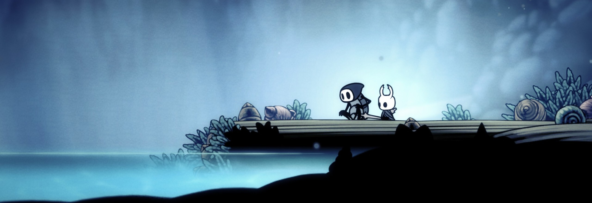

<div id="header" align="center">
  
</div>
<div id="badges" align="center">

  
  
</div>

<h1 align="center">
  Hello world!
</h1>
<div align="center">
  
</div>

---
### 💜 Sobre mim:

```py
class WhoAmI:
	user = 'Antonio Alex'
   	studied_at = "FATEC"
   	hobbies = [
            'Gamedev',
            'Animes e series',
            'Jogos independentes!',
            'algoritmos em python',
            'Coca-cola'
        ]
   
   def getCity():
   	return Sao_Jose_Dos_Campos()
   
   def Ambitions():
   	CriarUmJogo()
   	AprenderSobreIAs()
   	FicarForte()
   	# Há mais uns 15 objetivos aqui no meio :)
   
```

---

### :hammer_and_wrench: Linguagens e ferramentas :

  
<div align="center">
   
   
  
  
  
  
  
</div>

### 🎧 O que estou ouvindo agora:
<div align="center">
 
  

</div>

### 🔥 Status :
<div align="center">
  
[](https://git.io/streak-stats)


[](https://github.com/anuraghazra/github-readme-stats)
</div>
