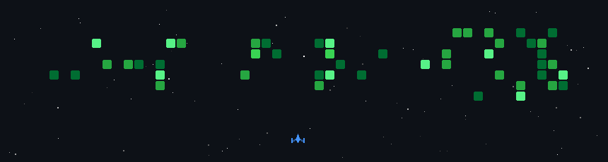
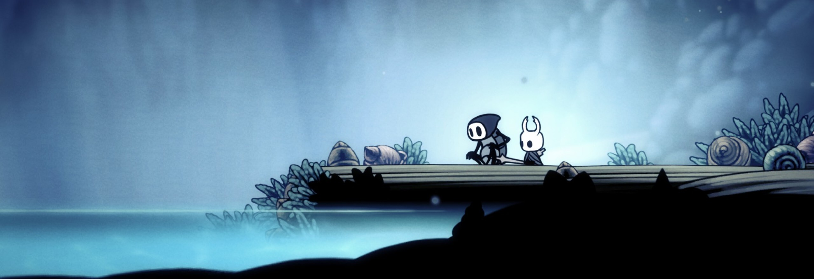

<div align="center">
  
</div>
<div align="center">
  
</div>
<div align="center">

[LinkedIn](https://www.linkedin.com/in/antonio-nepomuceno-04943720a) || [Portfolio](https://nepoun.dev/)

</div>

<br/>

```lua
local Antonio = {
    status    = "building stuff that (probably) works",
    based_in  = "São José dos Campos, BR",
    ship      = "FRAGMOS",  -- my solo indie game, YES it's happening
    stack     = { "C#", "Lua", "TypeScript", "Node", "React", "Unity", "Godot", "Ruby on Rails", "SQL/NoSql" },
}

function Antonio:when_not_coding()
    return { "Random indie games", "Cooking", "more coding" }
end
```

---

### 🚀 my commits, but better

<div align="center">
  
</div>

> *each enemy is a commit. I definitely need more enemies*

> *Made by czl9707*

---

### tools i actually use

<div align="center">
  
  
  
  
  
  
  
  
  
  
</div>

---

<div align="center">
  
</div>
